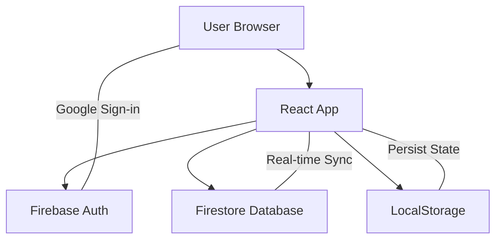

# 🏗️ Architecture Documentation

## Overview

This document describes the technical architecture of the Personal Finance Management application. The app follows a modern React architecture with Firebase backend, designed for maintainability and scalability.

## High-Level Architecture



## Technology Stack

### Frontend Layer
- **React 19** - Component-based UI framework
- **TypeScript** - Static type checking
- **Vite** - Build tool and dev server
- **Tailwind CSS** - Utility-first styling

### State Management
- **Zustand** - Lightweight state management
  - Simpler than Redux
  - Built-in React hooks
  - Middleware support (persist)

### Data Layer
- **Firebase Firestore** - NoSQL cloud database
  - Real-time synchronization
  - Offline support
  - Automatic scaling

- **Firebase Auth** - Authentication service
  - Google OAuth integration
  - Secure session management

## Project Structure

```
src/
├── components/          # React UI Components
│   ├── Analytics/      # Charts and statistics
│   │   ├── Charts.tsx
│   │   └── Comparison.tsx
│   ├── Auth/           # Authentication
│   │   └── Login.tsx
│   ├── Dashboard/      # Main dashboard
│   │   ├── OverviewCards.tsx
│   │   └── TopCategories.tsx
│   ├── Layout/         # App structure
│   │   ├── AppShell.tsx
│   │   └── Header.tsx
│   └── Transactions/   # Transaction management
│       ├── TransactionForm.tsx
│       └── TransactionList.tsx
│
├── hooks/              # Custom React Hooks (Future)
│
├── lib/                # External Service Integrations
│   └── firebase.ts     # Firebase configuration
│
├── store/              # State Management
│   ├── useStore.ts     # Main app store (transactions)
│   └── useAuthStore.ts # Authentication store
│
├── types/              # TypeScript Definitions
│   ├── index.ts        # Core types (Transaction, Category)
│   └── chat.ts         # AI chat types
│
├── utils/              # Utility Functions
│   ├── analytics.ts    # Calculations (totals, stats)
│   ├── format.ts       # Formatting (currency, dates)
│   ├── cn.ts           # Class name utilities
│   ├── sound.ts        # Sound effects
│   └── weather.ts      # Weather integration
│
├── App.tsx             # Main application component
├── main.tsx            # Application entry point
└── index.css           # Global styles

```

## Data Flow

### 1. Authentication Flow

```
User clicks "Login with Google"
    ↓
Firebase Auth handles OAuth
    ↓
Receive user credentials
    ↓
Store userId in Zustand
    ↓
Fetch user's transactions from Firestore
    ↓
Render dashboard
```

### 2. Transaction Management Flow

```
User fills transaction form
    ↓
Submit event triggered
    ↓
Validation (amount > 0, required fields)
    ↓
Optimistic UI update (Zustand)
    ↓
Save to Firestore
    ↓
Firestore confirms success/error
    ↓
UI reflects final state
```

### 3. State Synchronization

```
App loads
    ↓
Check if user is authenticated
    ↓
If yes: fetchTransactions() from Firestore
    ↓
Store in Zustand
    ↓
Zustand persists to LocalStorage
    ↓
Components subscribe to Zustand state
    ↓
Auto re-render on state changes
```

## State Management Design

### Zustand Store: `useStore`

**Location:** `src/store/useStore.ts`

**Responsibilities:**
- Transaction CRUD operations
- Category management
- Firebase synchronization

**Key Methods:**
- `addTransaction()` - Create new transaction
- `updateTransaction()` - Edit existing
- `removeTransaction()` - Delete transaction
- `fetchTransactions()` - Load from Firebase

**State Structure:**
```typescript
{
  transactions: Transaction[],
  categories: Category[],
  userId: string | null,
  // ... methods
}
```

### Persistence Strategy

We use `zustand/persist` middleware to cache data locally:

- **LocalStorage key:** `expense-tracker-storage`
- **Purpose:** Offline access, faster initial load
- **Sync:** Firestore is source of truth, localStorage is cache

## Component Architecture

### Component Hierarchy

```
App.tsx
├── AppShell
│   ├── Header
│   └── Bottom Navigation
│
├── Login (if not authenticated)
│
└── Main Content (tabbed)
    ├── Overview Tab
    │   ├── OverviewCards
    │   ├── TopCategories
    │   └── TransactionList (recent 5)
    │
    ├── Analytics Tab
    │   ├── ComparisonStat
    │   ├── ExpensePieChart
    │   └── IncomeExpenseBarChart
    │
    ├── History Tab
    │   └── TransactionList (all)
    │
    └── Settings Tab
        └── Logout button

TransactionForm (Modal)
    ├── Type selector (Income/Expense)
    ├── Amount input
    ├── Date picker
    ├── Category selector
    ├── Payment method
    └── Description
```

### Design Patterns

#### 1. **Presentational vs Container Components**
- Transaction components handle both logic and UI
- Future refactor: Separate concerns

#### 2. **Optimistic UI Updates**
```typescript
// Update UI immediately
set((state) => ({ transactions: [newTransaction, ...state.transactions] }));

// Then sync with backend
await setDoc(doc(db, 'users', userId, 'transactions', id), newTransaction);
```

#### 3. **Compound Components**
Cards and stats use composition pattern for flexibility.

## Database Schema (Firestore)

### Collection Structure

```
/users/{userId}/transactions/{transactionId}
```

### Transaction Document

```typescript
{
  id: string,              // UUID
  type: 'income' | 'expense',
  amount: number,          // VND
  categoryId: string,      // Reference to predefined categories
  description: string,
  date: string,            // ISO date string (YYYY-MM-DD)
  paymentMethod: 'cash' | 'transfer' | 'e-wallet',
  createdAt: number        // Timestamp
}
```

### Categories (Client-side only)

Categories are stored in `types/index.ts` as a constant array. Not in database to keep it simple.

```typescript
{
  id: string,
  name: string,
  icon: string,    // Lucide icon name
  color: string    // Tailwind classes
}
```

## Security Model

### Firebase Rules (Recommended)

```javascript
rules_version = '2';
service cloud.firestore {
  match /databases/{database}/documents {
    match /users/{userId}/transactions/{transactionId} {
      // Users can only access their own transactions
      allow read, write: if request.auth != null && request.auth.uid == userId;
    }
  }
}
```

### Environment Variables

Sensitive configs are stored in `.env`:
- Firebase API keys
- Project IDs

**Never commit `.env` to git!**

## Performance Considerations

### Current Optimizations
- ✅ Vite for fast builds
- ✅ Optimistic UI updates
- ✅ LocalStorage caching

### Future Improvements
- [ ] Code splitting by route
- [ ] Lazy load Analytics components
- [ ] Virtual scrolling for long transaction lists
- [ ] Image optimization (if photos added)

## Scalability

### Current Limits
- **Firestore Free Tier:** 1GB storage, 50K reads/day
- **User capacity:** ~1000 active users
- **Transaction volume:** Millions (Firestore scales automatically)

### Scaling Strategy
If app grows:
1. Enable Firestore pagination
2. Implement infinite scroll
3. Archive old transactions (older than 2 years)
4. Upgrade to Blaze plan for unlimited usage

## Testing Strategy (Planned)

### Unit Tests
- `utils/format.ts` - Currency formatting
- `utils/analytics.ts` - Calculation logic

### Integration Tests
- Transaction CRUD flows
- Authentication flows

### E2E Tests
- Complete user journeys
- Payment scenarios

## Deployment

### GitHub Pages
- **Build:** `npm run build`
- **Deploy:** `npm run deploy`
- **Tool:** `gh-pages` package
- **Branch:** `gh-pages` (auto-created)

### CI/CD (Future)
- GitHub Actions for auto-deploy on merge to `main`
- Automated tests before deployment

## Known Limitations

1. **Single currency:** Only VND supported
2. **No recurring transactions:** Must add manually
3. **No budgets:** Only warnings at 20M VND
4. **No export:** Can't download as CSV/PDF yet
5. **No multi-user:** Each account is independent

## Future Enhancements

### Planned Features
- [ ] Budget setting per category
- [ ] Recurring transactions
- [ ] Multi-currency support
- [ ] Export to CSV/PDF
- [ ] Bill photo uploads
- [ ] AI spending insights
- [ ] Shared budgets (family accounts)

### Technical Debt
- [ ] Refactor `App.tsx` (too large)
- [ ] Extract custom hooks
- [ ] Add Error Boundary
- [ ] Implement proper loading states
- [ ] Add comprehensive tests

---

**Last Updated:** 2026-01-20  
**Maintainer:** Dung Nguyen
